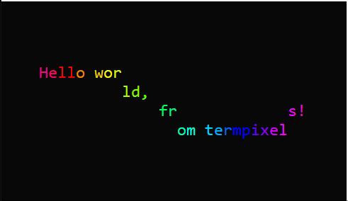

# termpixels
*the terminal as a character-cell matrix*

## Get it
[This project is on PyPI][pypi].

Alternatively, clone this repository and `pip install -e .` in the root directory.

Requires Python 3, and **no dependencies**\*!

\* Requires [`pytest`](https://pypi.org/project/pytest/) to run tests

## Purpose
Creating programs that run inside of terminals seems convoluted. The goal of termpixels is to **abstract the terminal into a 2D array of "pixels"**, or character cells, which each contain a single text character, a foreground color, and a background color. termpixels allows you to modify the screen contents anywhere, at any time, and then handles updating the terminal automatically, as well as simplifying complicated terminal input processing.

Ultimately, this project seeks to make the terminal *more accessible* and *more fun*.

## Limitations
There are lots of great libraries for coloring terminal output. This one is **designed for full-screen applications** that completely control the contents of the screen. That means that it, e.g., automatically saves and clears the screen, resets the cursor position, and accepts input in cbreak mode. 

It's not the best solution for simply printing colored text, though [you can do that if you want][text coloring].

## Demo

```python
from termpixels import App, Color
from time import time
from math import sin

class FunTextApp(App):
    def on_frame(self):
        self.screen.clear()                           # remove everything from the screen
        text = "Hello world, from termpixels!"
        
        for i, c in enumerate(text):
            f = i / len(text)
            color = Color.hsl(f + time(), 1, 0.5)     # create a color from a hue value
            x = self.screen.w // 2 - len(text) // 2   # horizontally center the text
            offset = sin(time() * 3 + f * 5) * 2      # some arbitrary math
            y = round(self.screen.h / 2 + offset)     # vertical center with an offset
            self.screen.print(c, x + i, y, fg=color)  # draw the text to the screen buffer
        
        self.screen.update()                          # commit the changes to the screen

if __name__ == "__main__":
    FunTextApp().start()
```

### More demos
* [DoomTerm](https://github.com/loganzartman/doomterm)
* [tpmatrix](https://github.com/loganzartman/tpmatrix)

## Features
* **Unix** (and **Mac**) terminal feature detection with terminfo (via Python [curses][python-curses])
* **Windows** support through Win32 Console API
* Terminal (re)**size detection**
* Asynchronous input
	* **Keyboard** input with support for special keys like arrows, function keys, escape, etc.
	* **Mouse** click and move input in terminals supporting xterm mouse
* 16, 256, and true **color** output (with detection for best supported mode)
* Display the **cursor** anywhere (or hide it!)
* **Preserves** the state of the user's terminal--doesn't clear it.
* No reliance on ncurses except for terminfo lookup
* 100% Python
* and more

## Inspiration
* [tcell][tcell]
* [ncurses][ncurses]
* [Build your own Command Line][byocl]

[python-curses]: https://docs.python.org/3/howto/curses.html
[tcell]: https://github.com/gdamore/tcell
[ncurses]: https://www.gnu.org/software/ncurses/
[pypi]: https://pypi.org/project/termpixels/
[byocl]: http://www.lihaoyi.com/post/BuildyourownCommandLinewithANSIescapecodes.html
[text coloring]: https://github.com/loganzartman/termpixels/blob/master/termpixels/examples/simple_text_coloring.py
